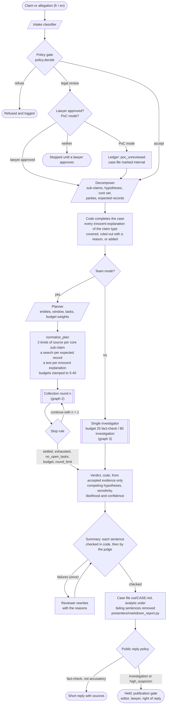
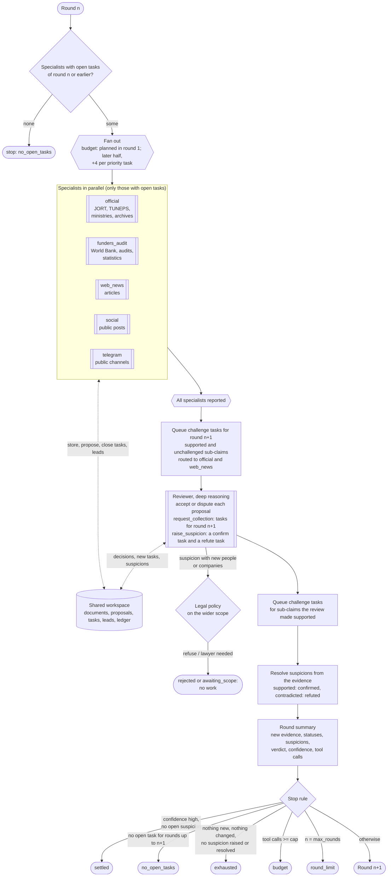
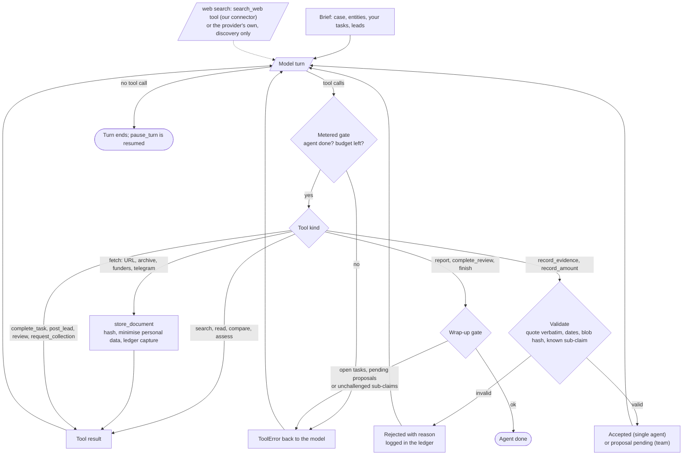
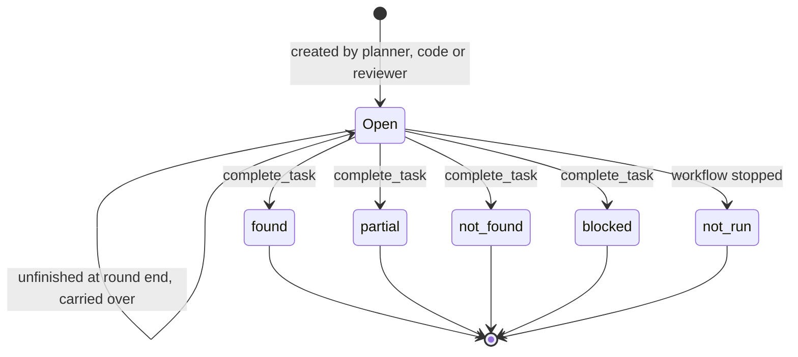
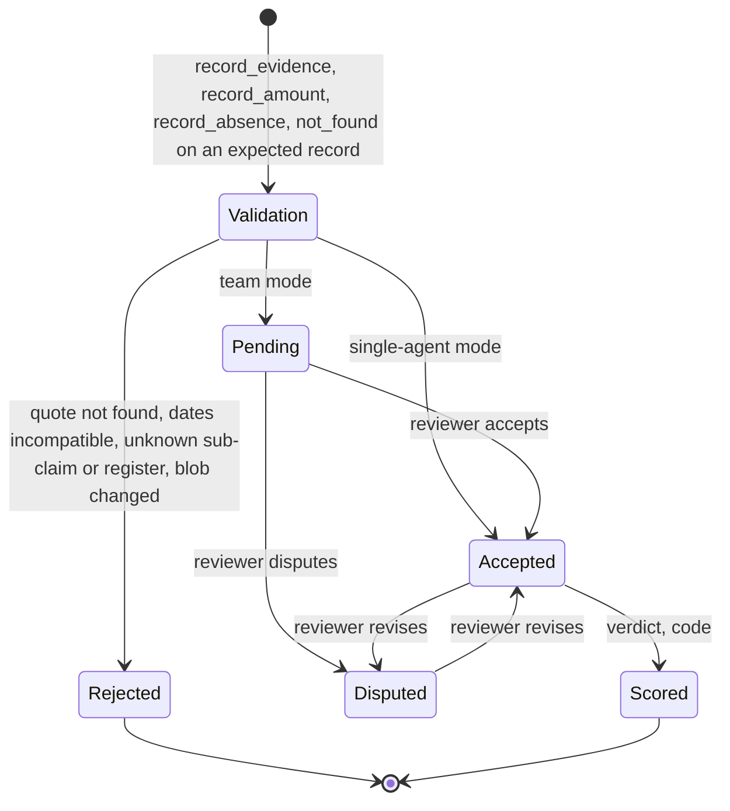

# The investigator agent

A Grok-style assistant that people can ask "is this true?", with one difference
that matters: Grok answers from what the model knows plus a live search, while
Caligula answers only from documents it has fetched, hashed and stored, and the
verdict is computed by code. Slower, but every answer can be replayed and
defended.

## Two modes, one engine

| | Fact-check | Investigation |
|---|---|---|
| Question | "Did the minister say X?" "Is the 12% figure right?" | "Were the expansion funds misused?" |
| Budget | 25 tool calls | 80 tool calls |
| Output | Short public reply with sources | Report for a human reviewer |
| Public reply | Verdict + sources + what is missing | Only "case opened, published after review" |
| Anything suggesting wrongdoing | Held for review (same as investigation) | Held for review |

## Workflow graph

The graphs below are the orchestration as implemented (`adapters/cli`,
`application/investigation/team.py`, `single_agent.py`, `toolkit.py`). Node shapes:

| Shape | Meaning |
|---|---|
| parallelogram | one structured model call |
| double-sided box | an agent: a model-driven tool loop |
| box | deterministic code |
| diamond | a decision taken by code |
| hexagon | parallel fan-out or join |
| stadium | start or end state |
| cylinder | shared state |

### 1. End to end

### 2. One collection round (team mode)

The loop runs until the case is settled or exhausted; the rest are hard
caps. A new suspicion always earns another round.

| Stop reason | Condition (checked after the review, in this order) |
|---|---|
| `settled` | confidence is high and no suspicion is open, even if follow-up work is queued |
| `no_open_tasks` | no open task for the next round, new or carried over |
| `exhausted` | from round 2: no new accepted evidence, no sub-claim status changed, no suspicion raised or resolved |
| `budget` | tool calls across all agents reached `--max-tool-calls` (default 600) |
| `round_limit` | `--rounds` reached (default 8); tasks still open appear as "not run" in the case file |

**Suspicions.** When the evidence makes the reviewer suspect something the
case does not test yet, `raise_suspicion` records it with what would confirm
it and what would refute it. Code ties it to a sub-claim (existing or new),
queues one task each way for the next round, and resolves its status from
that sub-claim's score after every review: the reviewer's opinion never
settles it. At most four per review. One that brings in people or companies
outside the claim goes through the intake policy first.

**Effort where it matters.** Follow-up rounds give each specialist half its
first-round budget plus four calls per priority task: tasks testing an open
suspicion, an innocent explanation not yet refuted, or a core sub-claim that
rests on one origin. The reviewer runs with deep reasoning (Claude effort
`xhigh`).

### 3. Inside an agent (tool loop)

The same `AgentRunner` port (adapters: `adapters/llm/claude_runner.py`, `adapters/llm/openai_compat.py`) runs the single investigator, each
specialist and the reviewer; only the tool set, the brief and the wrap-up
tool differ.

Wrap-up gates, each lifted only when the agent's budget is spent: `report`
(specialist) needs no open tasks, `complete_review` (reviewer) needs no
pending proposals, `finish` (single investigator) needs every supported
sub-claim challenged.

Tool sets per agent:

| Agent | Collect | Propose / decide | Coordinate | Wrap up |
|---|---|---|---|---|
| official | web search, `ingest_url`, archive captures | `record_evidence`, `record_amount` | tasks, leads | `report` |
| funders_audit | web search, `ingest_url`, `search_funder_records` | same | tasks, leads | `report` |
| web_news, social | web search, `ingest_url`, archive captures | same | tasks, leads | `report` |
| telegram | `fetch_telegram_channel` (public only) | same | tasks, leads | `report` |
| reviewer | none | `review_proposal`, own records (auto-accepted) | `request_collection`, leads | `complete_review` |
| single investigator | all collect tools | `record_*` (auto-accepted) | none | `finish` |

All agents can also search, read, compare versions and names, and `assess`.

### 4. Task lifecycle

Who creates tasks: the **planner** (round 1); **code** in `normalize_plan`
(coverage by two kinds of source, a search for every expected record, a test
for every innocent explanation) and around each review (challenge tasks);
the **reviewer** through `request_collection` (next round).

A task that searches for an expected record (`expectation_id`) and closes
`not_found` becomes an **absence finding**, proposed to the reviewer like any
evidence and weighed by the register's completeness.

### 5. Evidence lifecycle

Scoring counts each independent origin once (citation chains, copies and
versions of one document collapse), weights it by how hard the source is to
falsify and by the publisher's interest in the point, weighs absences by the
register's completeness, and applies the verdict rules in
[architecture.md](architecture.md#judgment).

## What code enforces

Whatever the models do:

- **Only stored documents count.** Web search finds pages; `ingest_url` or
  `ingest_archived_capture` hashes and stores them before they can be cited.
- **Quotes must be real.** Evidence whose quote is not found verbatim in the
  stored text is rejected.
- **Time must make sense.** Evidence observed before the event, or an
  editable official page first seen after the date it is supposed to predate,
  is rejected.
- **Challenge phase.** Supported sub-claims get challenge tasks (team) or
  block `finish` (single agent) until someone has looked for the innocent
  explanation.
- **Innocent explanations are mandatory.** Each claim type has standard
  lawful explanations (emergency procedure, erratum, price shock...). The case
  covers each one, rules it out with a reason shown in the case file, or code
  adds it as a hypothesis to test, with its own task. A confirmed one caps the
  verdict below `high_suspicion`.
- **Interested sources weigh accordingly.** What a party says in its own
  favour is halved; what it concedes against its interest counts as strong.
- **Absence counts only when it can be checked:** a known register, a stated
  query, a window the search could cover, ideally a capture of the empty result.
- **Judgment is computed.** Ratings of evidence against hypotheses, the
  ranking of hypotheses, what the conclusion depends on, the likelihood and
  the confidence all come from code; models only change them by adding or
  disputing evidence.
- **Persistence before "not found".** A task closes `not_found`, and an
  absence is recorded, only after three different searches by that agent for
  it; searches the workspace cannot see (the provider's built-in search) are
  declared and logged as such.
- **Suspicions are tested both ways** and resolved by the evidence; widening
  the case to new people or companies needs the legal policy's approval.
- **Budgets.** Each tool call spends the agent's budget; at zero only the
  wrap-up tools work.
- **Citations, sentence by sentence.** Every item that counts gets an
  evidence id (E1, E2...). A summary cites those ids in each factual
  sentence; code checks that the ids count, that every figure is in a cited
  quote (or vouched for by the financial check), every reference in the
  cited documents and every name in the cited sources. A judge model then
  reads each sentence against its quotes, and its "supported" stands only if
  it quotes the words that carry the claim. A summary is sent back once by
  code at `complete_review`/`finish`, once more after the judge; what still
  fails is removed from the published text and listed in the case file.
- **Prompt injection is contained.** A page that says "ignore your
  instructions" can at most make a model *propose* something; nothing counts
  unless it passes validation and, in team mode, review.

## Components and their tasks

| Component | Kind | Decides | Cannot |
|---|---|---|---|
| Intake classifier | 1 model call | how to describe the request | accept or refuse it (code does) |
| Decomposer | 1 model call | sub-claims, hypotheses, core set, parties, bearing, expected records | invent ids or registers later used by code (filtered); skip an innocent explanation (code adds it) |
| Planner | 1 model call | entities, window, tasks, budget weights | leave a core sub-claim on one kind of source |
| Specialists (x5) | tool loops, parallel | what to search, fetch, propose; task outcomes | make evidence count; use other specialists' tools |
| Reviewer | tool loop, deep reasoning | accept / dispute; new tasks; declare parties; raise suspicions | collect; close with pending proposals; rate evidence against hypotheses or settle a suspicion (code does); widen the scope without the legal policy |
| Orchestrator | code | rounds, budgets and priorities, challenge tasks, suspicion status, stopping | be overridden by any model |
| Validator / scorer | code | what is valid, statuses, verdict | be skipped |
| Report | code | the case file | include anything not traceable |

## Tasks

A task is the unit of work: `{specialist, objective, sub-claims, purpose
(support | challenge | explore), queries, urls, round, created_by (planner |
code | reviewer), expectation_id}`. Closing it requires an outcome:

- `found` / `partial`: with the documents that answer it
- `not_found`: searched properly, nothing in reach. **Absence is evidence**
  (no tender notice on TUNEPS) and appears in the case file; on a task with
  an `expectation_id` it is scored.
- `blocked`: source unreachable or access we do not have; a gap to report.

Unfinished tasks carry over to the next round; tasks still open at the end
appear as "not run" in the case file.

## Leads board

Specialists run in parallel and cannot see each other's work mid-round, so
they `post_lead(to, note)`: a URL, a spelling, a decree number. Recipients see
leads in `list_tasks`; the reviewer sees leads addressed to it in its brief.

## PoC mode

On by default (`--no-poc` to turn off). Cases the policy routes to legal
review proceed, the ledger records that the review was skipped, and the case
file carries a banner: internal working document, not for publication.
Refusals (espionage, private life, no documented act, no public nexus) still
apply.

## Suspecting shady cases proactively

Waiting for someone to ask misses most cases. Three monitors can open cases on
their own, each feeding the same workflow through a triage queue:

1. **Procurement red flags** (`caligula screen`, `domain/services/red_flags.py`): score every
   new award for non-competitive procedure, missing notice, single bidder,
   rushed deadline, newly created supplier, price above estimate, inflating
   amendments, splitting under thresholds, supplier dominance, timeline
   inconsistencies; and companies for low capital against the award, address
   clusters, and bidders sharing people or addresses. High scores open an
   investigation.
2. **Retcon monitor**: re-fetch watched official pages (JORT, TUNEPS, ministry
   communiqués) on a schedule, archive each version, and alert when an amount,
   date or decree number changes silently.
3. **Stance monitor** (the original Caligula idea): archive politicians'
   public statements and flag reversals or deletions, then fact-check the new
   position against the old one.

## Decisions taken

1. Channels: to be decided; the engine is channel-agnostic.
2. Reviewer: an agent for now (above); expert rubrics later.
3. Scope: companies, public bodies, public officials in their public role, and
   private individuals only through a documented link. No espionage
   accusations, no "could be planning". See [legal.md](legal.md), section 3.
4. Language: French and English (prompts, OCR default `fra+eng`, replies in the
   language of the claim).
5. Sources: every lawful source, including formal access-to-information
   requests; official claims stored as published as proof. See
   [legal.md](legal.md), section 4.
