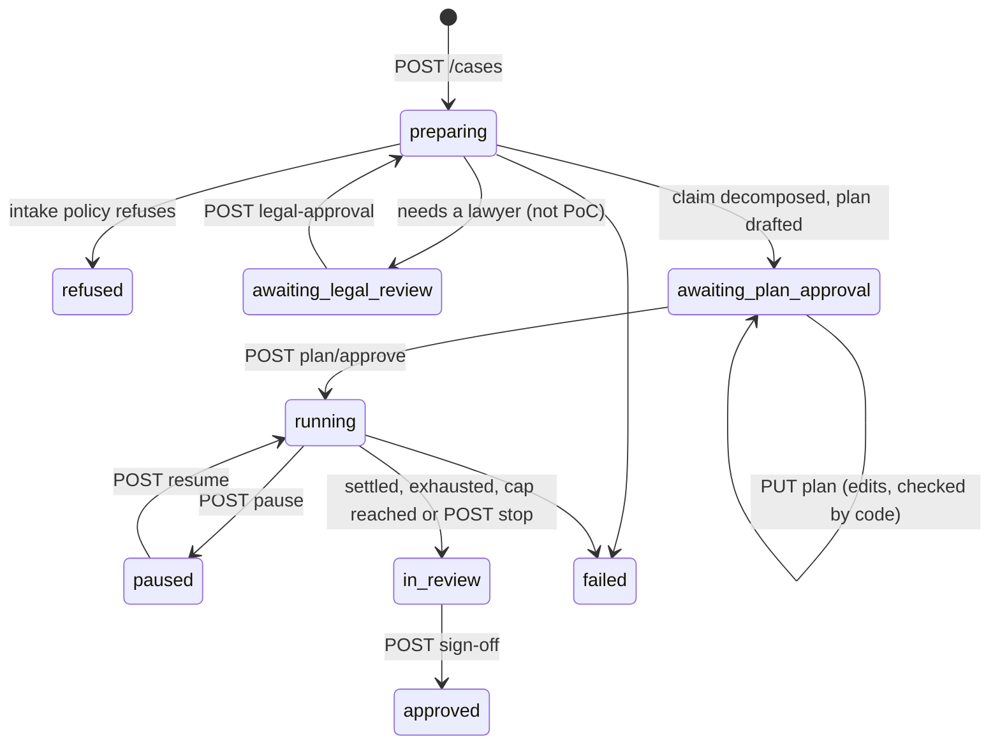

# HTTP API

The API the investigation interface is built on. It sits over the case
service (`application/cases/service.py`): the agents investigate and propose,
a person decides at each checkpoint, and every decision goes to the case's
ledger with who took it.

```bash
pip install -e '.[api]'
caligula serve --replay fixtures/steg_synthetic            # replayed cases only, no model needed
caligula serve --llm openai:qwen3@http://localhost:8000/v1 --search searxng --ledgers cases/ \
               --cors http://localhost:5173                  # new cases, with a model
```

Interactive documentation (OpenAPI) is at `/docs` once the server runs.

## Who acts

Every write needs the `X-Caligula-User` header: the name recorded in the
ledger with the act ("plan approved by Amira"). Headers are ASCII, so the
name is URL-encoded UTF-8 (`Ma%C3%AEtre%20Fictive`). This identifies; it does
not authenticate yet. Roles and sign-in come with the interface (F-series in
[roadmap.md](roadmap.md)); until then run the API on a trusted network only.

## Case lifecycle



## Endpoints and the interface surfaces they serve

All paths start with `/api`. Reads never change anything.

| Surface (UI spec) | Method and path | Notes |
|---|---|---|
| Case list, case header | `GET /cases`, `GET /cases/{id}` | status, assessment so far (verdict, likelihood, confidence and why), counts, stop reason, pending approvals, sign-off |
| Needs-attention queue | `GET /approvals` | across cases: legal review, plan approval, scope decisions, sign-off, each with the role it waits for |
| Empty state → new case | `POST /cases` `{claim, mode?, poc?, case_id?}` | 202; intake, decomposition and planning run in the background |
| Approval checkpoint: legal | `POST /cases/{id}/legal-approval` `{note}` | lawyer approves the scope |
| Investigation plan card | `GET /cases/{id}/plan`, `PUT /cases/{id}/plan` `{tasks}`, `POST /cases/{id}/plan/approve` | an edit is checked like the planner's draft: what code puts back is listed in `fixes` |
| Agent running, pause, stop | `POST /cases/{id}/pause`, `/resume`, `/stop` | agents hold at their next tool call; a stop ends the run with stop reason `stopped` |
| Live step tracker | `GET /cases/{id}/events?after=N`, `GET /cases/{id}/events/stream` | events: `status`, `phase`, `tool` (agent, tool, arguments, outcome), `audit` (ledger entries), `error`; the stream is server-sent events, resumable with `Last-Event-ID` |
| Claims board, claim cards | `GET /cases/{id}/claims` | each sub-claim's status, likelihood, confidence and reasons, evidence ids for / against / qualifying, independent origins; hypotheses (ACH), ruled-out explanations, what the conclusion depends on |
| Evidence, citation chips | `GET /cases/{id}/evidence` | each item by evidence id (the id summaries cite) and proposal id: quote or search, source, reliability tier, weight, publisher interest, review |
| Document viewer, chain of custody | `GET /cases/{id}/documents`, `GET /cases/{id}/documents/{doc_id}` | hashes, captures from the ledger, bytes intact, evidence that uses it; the single document adds its text and the quotes to highlight |
| Timeline | `GET /cases/{id}/timeline` | documents used, events the claim dates, rewritten records flagged |
| Suspicions, scope checkpoint | `GET /cases/{id}/suspicions`, `POST /cases/{id}/suspicions/{sid}/scope` `{approve, note}` | a suspicion naming new people or companies waits for a lawyer |
| Report builder | `GET /cases/{id}/report` (Markdown), `GET /cases/{id}/summary` | the case file in the analytic order; the summary as written, as published after the citation check, and each sentence's check |
| Sign-off | `POST /cases/{id}/sign-off` `{note}` | only from `in_review`; records the approver, time and ledger head |
| Audit log | `GET /cases/{id}/audit?action=&actor=` | ledger entries with their hashes, and the chain's integrity |

Errors: `401` no user, `404` unknown case or document, `409` a checkpoint in
the wrong state (the message says which), `422` a malformed body.

## Not there yet

- **Persistence of cases.** Cases live in the server's memory; documents
  persist in the store (Postgres with `--db`) and ledgers in files with
  `--ledgers`. Restoring cases after a restart comes with a case repository.
- **Authentication and roles**, and routing checkpoints to roles.
- **Continuing a finished run** (e.g. after a late scope approval queues
  tasks): open a new case for now.
- **Entity graph and money-flow views**: they wait for R10/R11 (entities,
  cross-referencing), so the API has no endpoint that would feed a decorative
  view.
